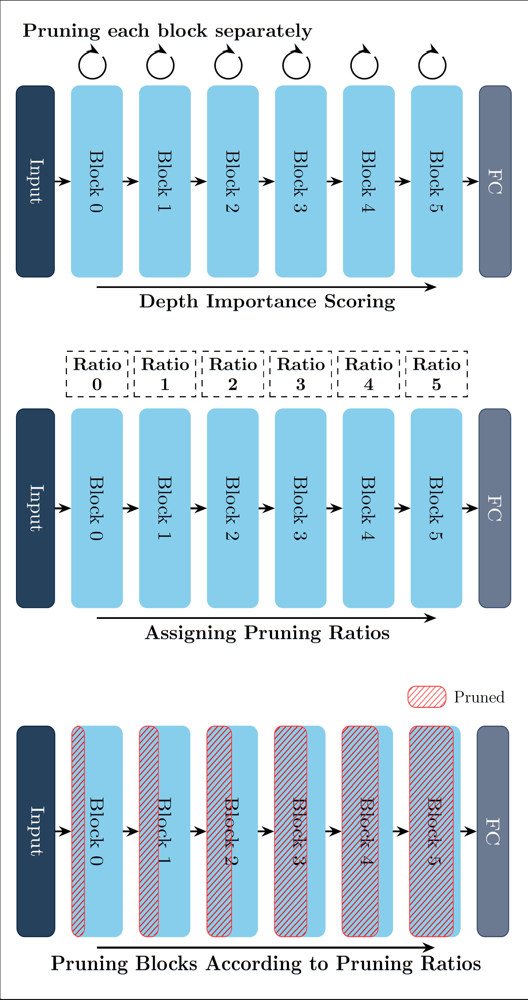

# 🏆 **Efficient Extra Tiny MobileNetV2 for Wake Vision Challenge**


This repository presents my solution for the **Model-Centric Track** of the **Wake Vision Challenge**, where I designed an efficient and compact model for **human presence detection in images**.

### 🏗 **The Approach**
My solution is based on a structurally **pruned version of MobileNetV2**, optimized to **minimize Multiply-Accumulate Operations (MACs) and reduce the number of parameters**. The pruning methodology follows the approach introduced in our recently accepted paper at the **IEEE International Conference on Communications (IEEE ICC)** (see figure below).

Since our pruning framework was originally developed for PyTorch, but this challenge required a TensorFlow implementation, I first **applied our pruning algorithm to MobileNetV2 in PyTorch**. After obtaining the pruned model, I **manually reconstructed its TensorFlow counterpart** to ensure compatibility with the competition’s pipeline.

### ✂ **Pruning Methodology**
The algorithm prunes each block of layers to its **maximum extent**, then measures the corresponding reduction in MACs and parameters. MobileNetV2 blocks consist of **inverted residual structures** with depthwise and pointwise convolutions. To achieve aggressive pruning, we **retain only a single channel per layer** within each block.

<p align="center">
  
</p>


This process provides an **estimated importance score** for each block, which determines a **unique pruning ratio** per block. The final model undergoes **non-uniform structured pruning**, ensuring that **critical layers retain more parameters while others are pruned more aggressively**.

### 🤖 **Why MobileNetV2?**
MobileNetV2\_0.25 was already a strong baseline for this task, featuring a **uniform 25% channel reduction across all layers**. However, I believed that some layers were **more critical than others**, requiring more than 25% retention. To address this, I applied **non-uniform structured pruning**, prioritizing essential layers while significantly reducing the model size.

### 🎯 **Further Optimization**
To further **reduce MACs**, I **downsampled the input size** from the standard **(224, 224, 3) to (80, 80, 3)**, enhancing efficiency without compromising performance.

#### **📊 Model Performance**
| Flash [B] | RAM [B] | MACs | Deployability | Test Acc. | Norm. Test Acc. | Score |
|-----------|--------|--------|---------------|-----------|----------------|-------|
| 55392     | 61968  | 3887331 | 0.8           | 0.75      | 0.94           | 0.78  |


### 🏅 **Competition Results**
This solution achieved **4th place** in the **Wake Vision Challenge**. More details about the challenge can be found [here](https://edgeai.modelnova.ai/challenges/details/challenge-edge:-wake-vision).


### 🔌 **Model Deployment**

After designing an efficient and high-performing model, I deployed it on the **OpenMV H7 microcontroller board** ([GitHub repo](https://github.com/openmv/openmv.git)).

<p align="center">
  
</p>

To facilitate deployment, I used the [**Edge Impulse Python SDK**](https://docs.edgeimpulse.com/docs/tools/edge-impulse-python-sdk), which streamlined the process of converting and flashing the model onto the board.

For visual feedback, I utilized the onboard LED:
- **Green** indicates **human presence detected**
- **Red** indicates **no presence detected**

As demonstrated below, the LED turns **green** when I am visible in the frame:


<p align="center">
  
</p>

<p align="center">
  
</p>


And it turns **red** when my body is obscured or when there is no person in the frame:

<p align="center">
  
</p>

<p align="center">
  
</p>

<p align="center">
  
</p>

<!-- The model also demonstrates strong performance in crowded or complex scenes. For instance, it successfully detects my labmate in the following examples:

<p align="center">
  
</p>

<p align="center">
  
</p> -->


---

# 🚀 **Model-Centric Track**

Welcome to the **Model-Centric Track** of the **Wake Vision Challenge**! 🎉

This track challenges you to **push the boundaries of tiny computer vision** by designing innovative model architectures for the newly released [Wake Vision Dataset](https://wakevision.ai/).

🔗 **Learn More**: [Wake Vision Challenge Details](https://edgeai.modelnova.ai/challenges/details/1)

---

## 🌟 **Challenge Overview**

Participants are invited to:

1. **Design novel model architectures** to achieve high accuracy.
2. Optimize for **resource efficiency** (e.g., memory, inference time).
3. Evaluate models on the **public test set** of the Wake Vision dataset.

You can modify the **model architecture** freely, but the **dataset must remain unchanged**. 🛠️

---

## 🛠️ **Getting Started**

### Step 1: Install Docker Engine 🐋

First, install Docker on your machine:
- [Install Docker Engine](https://docs.docker.com/engine/install/).

---

### 💻 **Running Without a GPU**

Run the following command inside the directory where you cloned this repository:

```bash
sudo docker run -it --rm -v $PWD:/tmp -w /tmp andregara/wake_vision_challenge:cpu python model_centric_track.py
```

- This trains the [ColabNAS model](https://github.com/harvard-edge/Wake_Vision/blob/main/experiments/comprehensive_model_architecture_experiments/wake_vision_quality/k_8_c_5.py), a state-of-the-art person detection model, on the Wake Vision dataset.
- Modify the `model_centric_track.py` script to propose your own architecture.

💡 **Note**: The first execution may take several hours as it downloads the full dataset (~365 GB).

---

### ⚡ **Running With a GPU**

1. Install the [NVIDIA Container Toolkit](https://docs.nvidia.com/datacenter/cloud-native/container-toolkit/latest/install-guide.html).
2. Verify your [GPU drivers](https://ubuntu.com/server/docs/nvidia-drivers-installation).

Run the following command inside the directory where you cloned this repository:

```bash
sudo docker run --gpus all -it --rm -v $PWD:/tmp -w /tmp andregara/wake_vision_challenge:gpu python model_centric_track.py
```

- This trains the [ColabNAS model](https://github.com/harvard-edge/Wake_Vision/blob/main/experiments/comprehensive_model_architecture_experiments/wake_vision_quality/k_8_c_5.py) on the Wake Vision dataset.
- Modify the `model_centric_track.py` script to design your own model architecture.

💡 **Note**: The first execution may take several hours as it downloads the full dataset (~365 GB).

---

## 🎯 **Tips for Success**

- **Focus on Model Innovation**: Experiment with architecture design, layer configurations, and optimization techniques.
- **Stay Efficient**: Resource usage is critical—consider model size, inference time, and memory usage.
- **Collaborate**: Join the community discussions on [Discord](https://discord.com/channels/803180012572114964/1323721491736432640) to exchange ideas and insights!

---

## 📚 **Resources**

- [ColabNAS Model Documentation](https://github.com/AndreaMattiaGaravagno/ColabNAS)
- [Docker Documentation](https://docs.docker.com/)
- [Wake Vision Dataset](https://wakevision.ai/)

---

## 📞 **Contact Us**

Have questions or need help? Reach out on [Discord](https://discord.com/channels/803180012572114964/1323721491736432640).

---

🌟 **Happy Innovating and Good Luck!** 🌟
